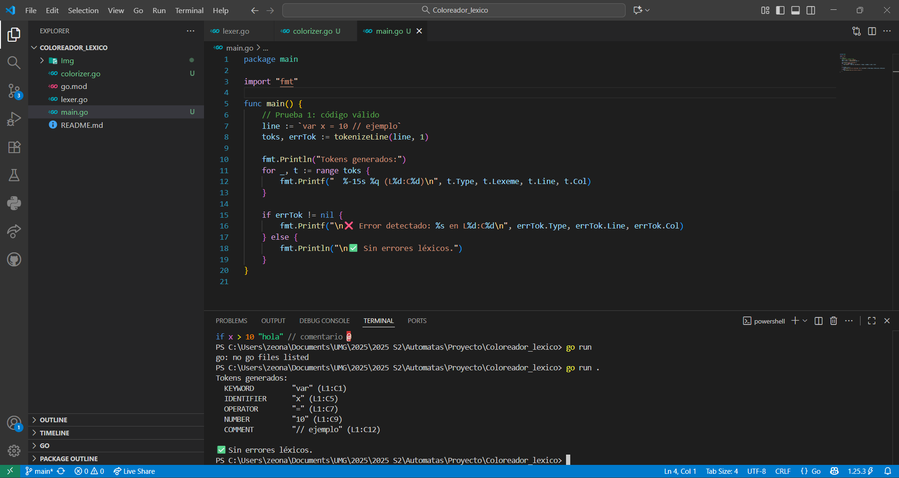
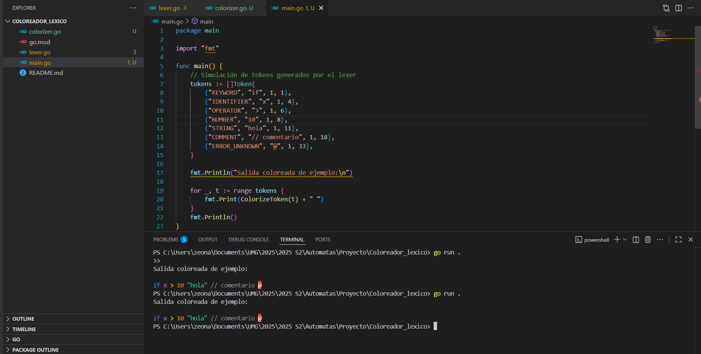
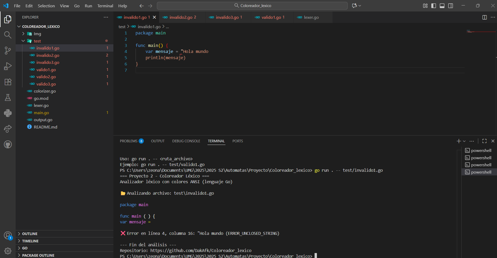

<<<<<<< HEAD
# Coloreador_lexico
El proyecto consiste en crear un Coloreador Léxico para analizar cadenas relacionadas con los tokens del lenguaje de programación asignado en el primer proyecto. La información debe leerse desde un archivo de texto y mostrarse en pantalla, coloreando cada cadena según su token.
=======
#  Proyecto 2 – Coloreador Léxico (Go)

##  Descripción
Analizador léxico desarrollado en **Go** que lee archivos fuente, identifica tokens y los muestra en la terminal con **colores ANSI** según su tipo.

Este proyecto es una extensión del **Proyecto 1 (Reconocedor de Tokens)**, donde ahora se aplica **colorado léxico** y **detección de errores**.

---

##  Integrantes y división del trabajo
| INTEGRANTE | Archivo / Rol | Descripción |
|----------|----------------|--------------|
| 1️⃣ | `lexer.go` | Analizador léxico (detección de tokens y errores) |
| 2️⃣ | `colorizer.go` | Asignación de colores según tipo de token |
| 3️⃣ | `output.go` | Integración de lexer + colorizador + salida en consola |
| 4️⃣ | `main.go`, `README.md`, `test/` | Ejecución, documentación y pruebas del proyecto |

---

##  Requisitos
- Lenguaje: **Go (Golang)**
- Versión mínima: **1.20+**
- Editor recomendado: **VS Code** (tema oscuro)
- Sistema operativo: compatible con Windows, Linux o macOS

---

##  Estructura del proyecto
Coloreador_lexico/
├── lexer.go
├── colorizer.go
├── output.go
├── main.go
├── go.mod
└── test/
├── valido1.go
├── valido2.go
├── valido3.go
├── invalido1.go
├── invalido2.go
└── invalido3.go

---

##  Reglas de coloreado

| Tipo de Token | Ejemplo | Color en consola |
|----------------|----------|------------------|
| Palabras reservadas | `if`, `for`, `func`, `return` |  Azul |
| Números y constantes | `10`, `true`, `false` |  Naranja |
| Strings | `"texto"` |  Verde claro |
| Agrupadores | `(` `)` `{` `}` `[` `]` |  Blanco |
| Operadores | `+`, `-`, `%`, `==`, `>=` |  Amarillo |
| Identificadores | `x`, `nombre`, `contador` |  Rosado |
| Comentarios | `// comentario` |  Gris |
| Errores léxicos | `@`, `"sin cerrar` | Fondo rojo / texto blanco |

---

##  Archivos de prueba
Los archivos dentro de la carpeta `/test` permiten probar el comportamiento del analizador.

| Archivo | Resultado esperado | Descripción |
|----------|--------------------|--------------|
| `valido1.go` |  Válido | Factorial básico |
| `valido2.go` |  Válido | Ejemplo con operadores y comentarios |
| `valido3.go` |  Válido | Ejemplo con bucle `for` y booleanos |
| `invalido1.go` |  Error | Cadena sin cerrar |
| `invalido2.go` |  Error | Símbolo desconocido |
| `invalido3.go` |  Error | Variable mal formada |

---

##  Ejecución del programa

1️) Clonar el repositorio:
```bash
git clone https://github.com/DakAfk/Coloreador_lexico_F.git
cd Coloreador_lexico_F

2️) Ejecutar el programa con un archivo de prueba:
go run . -- test/valido1.go

3) Ejemplo de salida:
=== Proyecto 2 - Coloreador Léxico ===
Analizador léxico con colores ANSI (lenguaje Go)

📂 Analizando archivo: test/valido1.go

✅ Archivo válido. No se detectaron errores léxicos.

Observaciones

Se detiene el análisis en el primer error léxico.

Compatible con modo oscuro de terminal (VS Code).

Salidas coloridas mediante secuencias ANSI (\033[xxm).

Se puede extender con soporte para operadores dobles (==, !=, <=, >=, etc.).

```markdown


```markdown


```markdown
